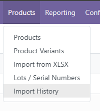
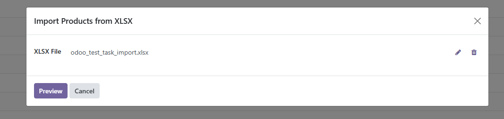
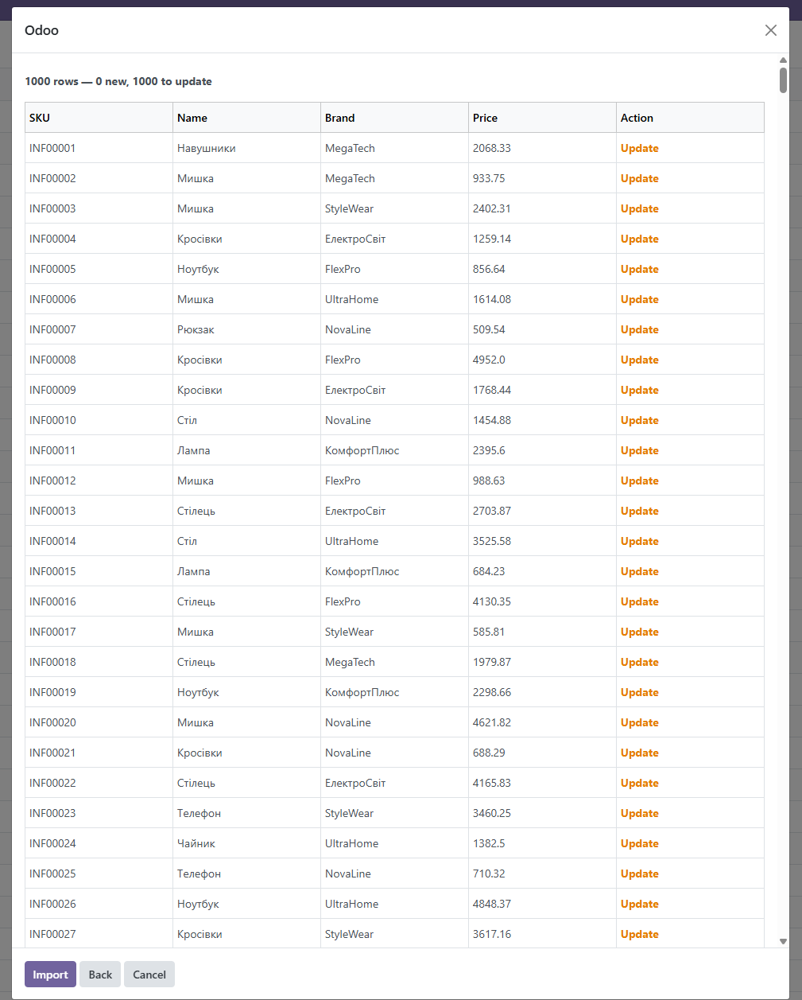
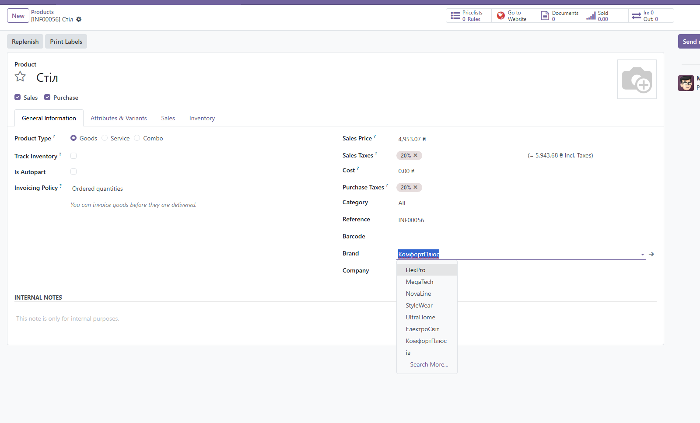
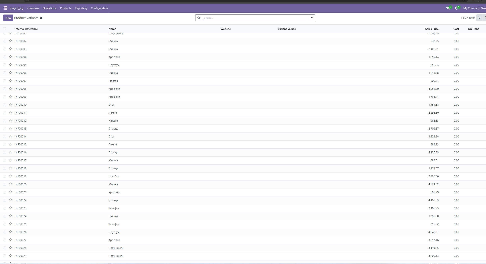
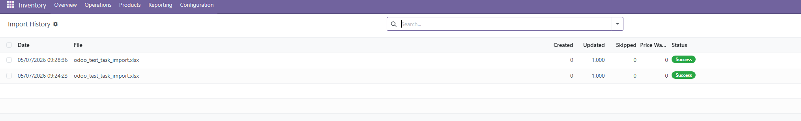

# inforce_product_import

Модуль Odoo 18 для імпорту товарів із XLSX-файлу через візард.

## Можливості

- Імпорт товарів із XLSX одним кліком
- Попередній перегляд перед імпортом (Preview): показує які товари будуть створені, а які оновлені
- Автоматичне створення брендів, одиниць виміру та атрибутів варіантів якщо вони відсутні
- Оновлення існуючих товарів при повторному імпорті (пошук за артикулом)
- Журнал імпортів з датою, файлом та результатом
- Попередження про нульові або від'ємні ціни

## Структура XLSX-файлу

Файл повинен містити наступні колонки (назви обов'язкові):

| Колонка | Опис |
|---|---|
| Артикул | Унікальний код товару (SKU) |
| Товар | Назва товару |
| Бренд | Бренд / виробник |
| Варіант | Атрибут варіанту у форматі `Назва: Значення` (наприклад, `Колір: синій`) |
| Одиниця вимірювання | Одиниця виміру |
| Ціна за одиницю | Ціна продажу |

Зразок файлу: `inforce_product_import/static/src/odoo_test_task_import.xlsx`

## Встановлення

1. Додати шлях до модуля в `odoo.conf`:
   ```
   addons_path = ...,C:\odootest\InforceWizardTZ
   ```

2. Встановити модуль через інтерфейс Odoo:
   `Налаштування → Додатки → inforce_product_import`

   Або через командний рядок:
   ```bash
   python odoo-bin -d <назва_бд> -i inforce_product_import
   ```

3. Переконатись що встановлені залежності: `product`, `uom`, `stock`

## Використання

### Крок 1 — Відкрити візард

Перейти **Inventory → Products → Import from XLSX**



### Крок 2 — Завантажити файл

Прикріпити XLSX-файл і натиснути **Preview**.



### Крок 3 — Перегляд перед імпортом

Таблиця показує всі рядки: зелений **New** — нові товари, помаранчевий **Update** — оновлення існуючих.



### Крок 4 — Результат імпорту

Після натискання **Import** товари з'являються в каталозі з брендом, ціною та артикулом.



Список всіх імпортованих варіантів товарів:



### Крок 5 — Журнал імпортів

Переглянути результат у **Inventory → Products → Import History**



## Вимоги

- Odoo 18
- Python-бібліотека `openpyxl` (входить до стандартних залежностей Odoo 18)
